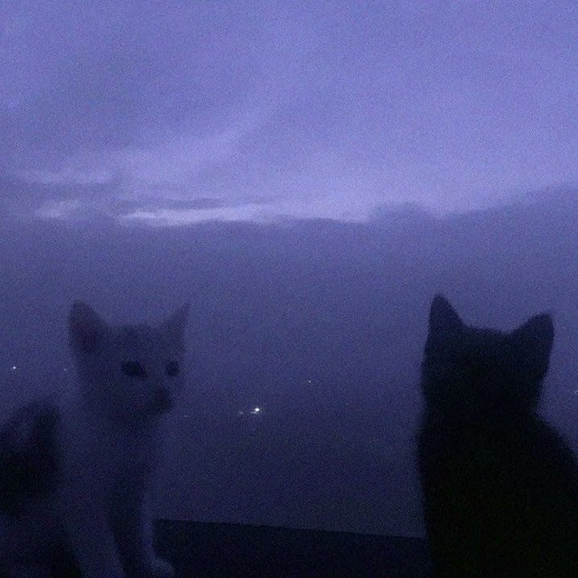

 

  

---

# About

**V0IDNETWORK** is a GitHub profile maintained by **Iliya** and **Ehsan**.

We enjoy building software, exploring new technologies, learning how systems work, and sharing our projects through open source.

Nothing more.

---

# Team

<table align="center">
<tr>

<td align="center" width="50%">

### Iliya

**Programmer**

</td>

<td align="center" width="50%">

### Ehsan

**Programmer**

</td>

</tr>
</table>

---

# Currently Learning

| Area | Progress |
|------|----------|
| Backend Development | █░░░░░░░░░ 1% |
| Networking | █░░░░░░░░░ 1% |
| Linux | █░░░░░░░░░ 1% |
| Systems | █░░░░░░░░░ 1% |
| Security | █░░░░░░░░░ 1% |
| Open Source | █░░░░░░░░░ 1% |

> We believe there is always more to learn.

---

# Tech Stack

### Languages

### Tools

---

# Projects

<table>
<tr>

<td width="50%">

## 🌐 Networking

Projects related to networking, protocols and infrastructure.

</td>

<td width="50%">

## ⚙️ Software

Applications, APIs and backend development.

</td>

</tr>

<tr>

<td width="50%">

## 🐧 Linux

Experiments, tools and system utilities.

</td>

<td width="50%">

## 🔓 Open Source

Everything we build is shared here.

</td>

</tr>
</table>

---

## GitHub Analytics

---

# Contributions

---

# Philosophy

> **Always Learning.**

> **Always Building.**

> **Still 1%.**

---

# Contact

 

